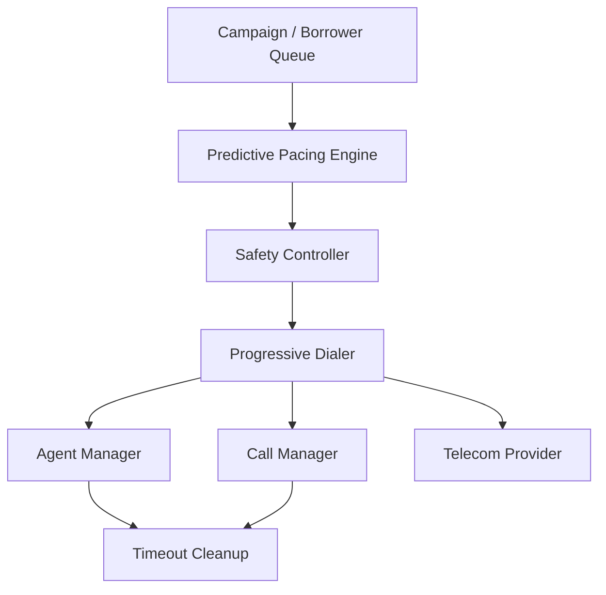

# SmartDialer – Predictive Dialing Simulator

A TypeScript/Node.js prototype of a **safe predictive dialing system** for call-centre environments.

The system is designed around one core rule:

> **Never allow more borrower calls to become agent-bound than the system can safely handle.**

SmartDialer combines a **Progressive Dialer** as a safe baseline with a **Predictive Pacing Engine** that estimates how aggressively the system can dial. A separate **Safety Controller** acts as the final deterministic gatekeeper before any calls are placed.

The project focuses on **system design, concurrency, state management, failure handling, idempotency, and safety** rather than external telecom infrastructure.

---

## 🎯 Project Objective

A call-centre dialer needs to keep agents productive without creating a situation where multiple customers answer while no agent is available.

For example:

```text
10 available agents
        ↓
Predictive Engine estimates answer rate = 70%
        ↓
May recommend more than 10 call attempts
        ↓
Safety Controller checks the current system state
        ↓
Only a safe number of calls is approved
        ↓
Progressive Dialer executes the approved calls
```

The important design principle is:

**Prediction can be aggressive, but execution must always be safe.**

---

# 🏗️ Architecture



### Main flow

```text
Campaign
   ↓
Predictive Pacing Engine
   ↓
Safety Controller
   ↓
Progressive Dialer
   ↓
Mock Telecom Provider
```

Supporting components manage agent state, call state, concurrency, idempotency, and stale reservations.

---

# 🔑 Core Components

## 1. Progressive Dialer

The Progressive Dialer is the **safe baseline**.

It follows the principle:

```text
1 available agent → at most 1 agent-bound call
```

For every call, the dialer:

1. Finds an available agent.
2. Atomically reserves the agent.
3. Atomically reserves a borrower call.
4. Changes the agent to `DIALING`.
5. Changes the call to `INITIATED`.
6. Places the call through the provider.
7. Processes the provider result.
8. Connects the agent if the call is answered.
9. Releases the agent when the call completes or fails.

The Progressive Dialer is also responsible for executing calls approved by the Safety Controller.

---

# 🧠 Predictive Pacing Engine

The Predictive Pacing Engine determines **how many calls should be attempted**.

It uses factors such as:

- Available agents
- Connected calls
- Ringing calls
- Historical answer rate
- Safety margin
- Provider health

A simplified calculation is:

```text
Available Capacity
        ↓
Estimate required attempts using answer rate
        ↓
Apply safety margin
        ↓
Adjust according to provider health
        ↓
Generate recommendation
```

Example:

```text
Available agents = 10
Answer rate      = 70%

Estimated attempts ≈ 10 / 0.70
                   ≈ 14
```

The engine may therefore recommend approximately 14 attempts.

However, **the Pacing Engine never places calls itself**.

Its responsibility ends at producing a recommendation.

---

# 🛡️ Safety Controller

The Safety Controller is the **final safety boundary** between prediction and execution.

It can:

- `APPROVE`
- `REDUCE`
- `REJECT`
- `FALLBACK_TO_PROGRESSIVE`

The controller verifies the current system state before allowing the dialer to execute a recommendation.

### Golden Rule

```text
Approved calls must never violate the available-agent safety boundary.
```

This separation is intentional:

```text
Predictive Engine
       ↓
 probabilistic recommendation
       ↓
Safety Controller
       ↓
 deterministic safety decision
       ↓
Progressive Dialer
```

This allows the predictive algorithm to evolve without giving it direct authority over call execution.

---

# 👥 Agent State Machine

Agents move through controlled states:

```text
OFFLINE
   ↓
AVAILABLE
   ↓
RESERVED
   ↓
DIALING
   ↓
CONNECTED
   ↓
WRAP_UP
   ↓
AVAILABLE
```

Agents can also be paused:

```text
AVAILABLE ↔ PAUSED
```

### Agent states

| State       | Meaning                              |
| ----------- | ------------------------------------ |
| `OFFLINE`   | Agent is not participating           |
| `AVAILABLE` | Agent can receive a call             |
| `RESERVED`  | Agent has been claimed by a worker   |
| `DIALING`   | A call is being placed for the agent |
| `CONNECTED` | Agent is speaking with a borrower    |
| `WRAP_UP`   | Agent is finishing post-call work    |
| `PAUSED`    | Agent is temporarily unavailable     |

Invalid state transitions are rejected by `AgentManager`.

---

# 📞 Call State Machine

Calls follow a controlled lifecycle:

```text
QUEUED
   ↓
RESERVED
   ↓
INITIATED
   ↓
RINGING
   ↓
ANSWERED
   ↓
CONNECTED
   ↓
COMPLETED
```

Failure/cancellation paths are also supported:

```text
QUEUED / RESERVED / INITIATED / RINGING / ANSWERED / CONNECTED
                                      ↓
                                   FAILED

QUEUED / RESERVED
       ↓
   CANCELLED
```

The `CallManager` validates state transitions before applying them.

---

# 🔒 Concurrency-Safe Reservations

One of the important problems in a multi-worker dialer is:

> What happens when two workers try to reserve the same agent at the same time?

SmartDialer uses atomic reservation methods such as:

```text
tryReserveAgent()
tryReserveCall()
```

The reservation operation checks the current state and changes it only when the resource is still available.

Example:

```text
Agent A1 = AVAILABLE

Worker 1 → tryReserveAgent(A1) → SUCCESS
Worker 2 → tryReserveAgent(A1) → FAIL

Agent A1 = RESERVED
```

This prevents multiple workers from believing they own the same agent.

The project includes multi-worker and load tests to demonstrate this behaviour.

---

# 🔁 Idempotent Event Handling

Telecom providers can sometimes send:

- duplicate events
- delayed events
- events in an unexpected order

For example:

```text
ANSWERED
ANSWERED
```

or:

```text
ANSWERED
COMPLETED
ANSWERED
```

The Call State Machine validates whether each transition is legal.

An event that cannot legally transition the current state is ignored/rejected rather than corrupting the call lifecycle.

This provides a basic form of **idempotent event handling**.

---

# 📡 Mock Telecom Providers

The project does not require a real telecom provider.

Instead, it defines a provider interface:

```text
TelecomProvider
```

Two mock implementations are included.

## FastProvider

Designed to represent a relatively healthy provider.

Characteristics include:

- Fast response
- Low failure rate
- Configurable answer rate
- No intentional duplicate/timeout behaviour

## UnreliableProvider

Designed to simulate telecom problems.

It can introduce:

- Slower responses
- Call failures
- Timeouts
- Duplicate events
- Configurable answer rates

This allows the dialer to be tested under both normal and degraded conditions.

---

# ⏱️ Timeout Recovery

Workers can fail while holding a reservation.

For example:

```text
Worker
  ↓
Agent RESERVED
  ↓
Worker crashes
  ↓
Agent remains RESERVED
```

Without recovery, the agent could remain unavailable indefinitely.

`TimeoutCleanup` identifies stale reservations using timestamps and releases resources that have remained in `RESERVED` or `DIALING` for longer than the configured timeout.

Conceptually:

```text
RESERVED
   ↓
timeout exceeded
   ↓
TimeoutCleanup
   ↓
AVAILABLE
```

This provides recovery from stale worker-owned state.

---

# 🧪 Simulation Scenarios

`simulation-runner.ts` demonstrates different operating conditions.

### Scenario A – Low Answer Rate

```text
Answer rate: 20%
```

Tests the system when relatively few calls are answered.

### Scenario B – Medium Answer Rate

```text
Answer rate: 50%
```

Represents a moderate operating condition.

### Scenario C – High Answer Rate

```text
Answer rate: 70%
```

Tests a situation where more calls are expected to connect.

### Scenario D – Unreliable Provider

Uses the unreliable provider to demonstrate failures and degraded telecom behaviour.

---

# 📈 Dynamic Scenario

The project also demonstrates how the pacing recommendation changes when system conditions deteriorate.

Example:

```text
Phase 1
Answer rate = 70%
Provider health = 100%
Recommendation = 10 calls

        ↓ conditions degrade

Phase 2
Answer rate = 50%
Provider health = 80%
Recommendation = 5 calls

        ↓ conditions degrade further

Phase 3
Answer rate = 20%
Provider health = 40%
Recommendation = 3 calls
```

The important observation is:

> **As confidence in successful call connections decreases, the pacing engine becomes more conservative.**

The Safety Controller still provides the final safety boundary regardless of the recommendation.

---

# 🧪 Testing

The project contains multiple levels of testing.

## Unit Tests

Vitest tests cover:

- Valid agent state transitions
- Invalid agent transitions
- Double reservation prevention
- Duplicate `ANSWERED` events
- Out-of-order events
- Duplicate `RESERVED` events

Run:

```bash
npm test
```

---

## Multi-Worker Test

Simulates multiple workers competing for the same pool of agents.

Run:

```bash
npm run test:multi
```

The test verifies that workers do not reserve the same agent simultaneously.

---

## Load Test

Simulates multiple workers and borrowers to exercise the reservation logic under higher contention.

Run:

```bash
npm run test:load
```

---

## Failure Test

Simulates worker failure and demonstrates recovery of stale resources.

Run:

```bash
npm run test:failure
```

---

## Simulation Test

Runs the predefined scenarios and prints pacing and call metrics.

Run:

```bash
npm run test:sim
```

---

# 🚀 Quick Start

## Prerequisites

- Node.js
- npm

## Installation

Clone the repository and install dependencies:

```bash
npm install
```

## Run the basic simulation

```bash
npx tsx src/index.ts
```

## Run unit tests

```bash
npm test
```

## Run the complete test suite

```bash
npm run test:all
```

## Run individual tests

```bash
npm run test:multi
npm run test:load
npm run test:failure
npm run test:sim
```

---

# 📁 Project Structure

```text
smart-dialer/
│
├── README.md
├── architecture.md
├── state-machines.md
├── architecture-decision.md
├── package.json
├── tsconfig.json
├── .gitignore
│
├── src/
│   ├── models/
│   │   ├── agent.ts
│   │   └── call.ts
│   │
│   ├── agents/
│   │   └── AgentManager.ts
│   │
│   ├── calls/
│   │   └── CallManager.ts
│   │
│   ├── dialer/
│   │   └── ProgressiveDialer.ts
│   │
│   ├── pacing/
│   │   └── PacingEngine.ts
│   │
│   ├── safety/
│   │   └── SafetyController.ts
│   │
│   ├── providers/
│   │   ├── TelecomProvider.ts
│   │   ├── FastProvider.ts
│   │   └── UnreliableProvider.ts
│   │
│   ├── utils/
│   │   └── TimeoutCleanup.ts
│   │
│   ├── index.ts
│   ├── multi-worker-test.ts
│   ├── load-test.ts
│   ├── failure-test.ts
│   └── simulation-runner.ts
│
└── tests/
    ├── agent.test.ts
    └── idempotency.test.ts
```

---

# 🧩 Design Decisions

## Why Progressive Dialing?

Progressive dialing provides a simple and deterministic baseline.

It is easier to reason about and provides a safe execution mechanism for the predictive system.

---

## Why Separate Prediction and Safety?

Prediction is inherently uncertain.

Historical answer rates and provider behaviour can change.

Therefore:

```text
Pacing Engine = recommendation
Safety Controller = authority
```

This separation ensures that an incorrect prediction cannot directly violate the system's safety invariant.

---

## Why Atomic Reservations?

Multiple workers may compete for the same agents and calls.

Atomic reservation prevents:

```text
Worker A → Agent 1
Worker B → Agent 1
```

from happening simultaneously.

---

## Why No Redis, Kafka, or Database?

This implementation is intentionally an **in-memory prototype**.

Adding infrastructure without needing it would increase complexity and distract from the core assignment requirements.

The architecture is designed so that persistent storage and distributed coordination could be introduced later for a production implementation.

---

# 📚 Documentation

Additional design documentation is included:

| File                       | Description                     |
| -------------------------- | ------------------------------- |
| `README.md`                | Project overview and usage      |
| `architecture.md`          | Detailed system architecture    |
| `state-machines.md`        | Agent and call state machines   |
| `architecture-decision.md` | Design decisions and trade-offs |

---

# 🛠️ Technology Stack

- **TypeScript**
- **Node.js**
- **tsx**
- **Vitest**
- **UUID**
- In-memory data structures
- Mock telecom providers

No external database, message queue, or real telecom provider is required.

---

## 👤 Author

**Harshal Khaire**

SmartDialer – Systems Design & Coding Assignment

Built with a focus on:

- System design
- Concurrency
- State machines
- Failure recovery
- Idempotency
- Safe predictive execution
