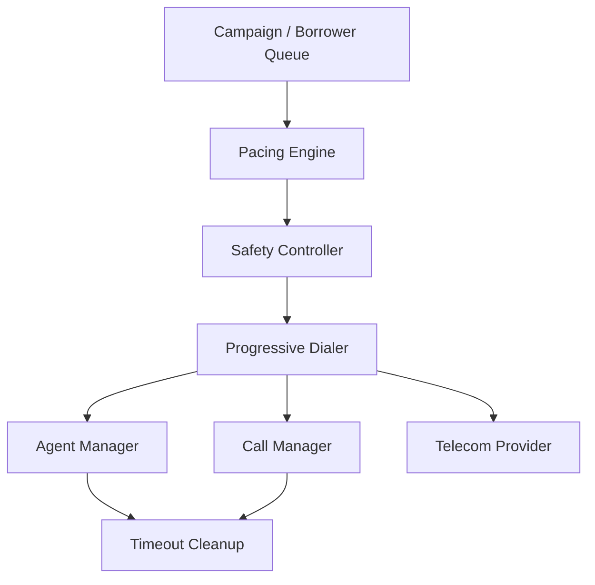

# Architecture Decisions

This document explains the major design decisions made while building SmartDialer and the reasoning behind them.

---

## 1. Progressive Dialer First

### Decision

Build the Progressive Dialer as the safe baseline before adding predictive pacing.

### Why?

Progressive dialing is deterministic:

```text
1 available agent → at most 1 agent-bound call
```

This makes the initial system easier to reason about and provides a safe execution mechanism for the predictive system.

### Benefit

Even if the predictive algorithm produces an incorrect recommendation, the Safety Controller and Progressive Dialer prevent unsafe execution.

---

## 2. Separate Predictive Pacing from Safety

### Decision

Keep the Predictive Pacing Engine and Safety Controller as separate components.

### Why?

Prediction is probabilistic, while safety must be deterministic.

The Predictive Pacing Engine estimates how aggressively the system can dial using metrics such as:

* Available agents
* Connected calls
* Ringing calls
* Historical answer rate
* Provider health
* Safety margin

However, it must never directly place calls.

The Safety Controller receives the recommendation and makes the final decision.

```text
Predictive Pacing Engine
          ↓
   Recommendation
          ↓
   Safety Controller
          ↓
   Safety Decision
          ↓
   Progressive Dialer
```

### Benefit

A prediction error cannot directly bypass the safety boundary.

The Safety Controller can:

* Approve
* Reduce
* Reject
* Fall back to progressive dialing

---

## 3. Atomic Agent and Call Reservation

### Decision

Use atomic reservation methods:

```text
tryReserveAgent()
tryReserveCall()
```

### Why?

Multiple workers may attempt to reserve the same resource at the same time.

For example:

```text
Agent A1 = AVAILABLE

Worker 1 → tryReserveAgent(A1) → SUCCESS
Worker 2 → tryReserveAgent(A1) → FAIL
```

Once the first worker successfully changes the agent to `RESERVED`, another worker cannot successfully reserve it.

### Implementation

The prototype uses in-memory `Map` structures.

The reservation operation checks the current state and changes it only when the resource is available.

### Production Consideration

In a multi-process or multi-server production deployment, this would need to be backed by persistent storage and a proper transactional or distributed coordination mechanism.

---

## 4. Idempotent Event Handling

### Decision

Validate provider events against the current call state before applying them.

### Why?

External telecom providers may produce:

* Duplicate events
* Delayed events
* Out-of-order events
* Failure events after retries

For example:

```text
ANSWERED
ANSWERED
```

The second `ANSWERED` event is not a valid transition from the current state and therefore does not change the call state again.

Similarly:

```text
ANSWERED
COMPLETED
ANSWERED
```

The final `ANSWERED` event cannot move a completed call backwards.

### Benefit

Invalid or duplicate provider events cannot arbitrarily corrupt the call lifecycle.

---

## 5. Timeout Recovery

### Decision

Track reservation timestamps and clean up stale resources.

### Why?

A worker may crash after reserving an agent:

```text
Worker
   ↓
Agent = RESERVED
   ↓
Worker crashes
   ↓
Agent remains RESERVED
```

Without recovery, the agent could remain unavailable indefinitely.

`TimeoutCleanup` checks for stale reservations and releases agents/calls that have exceeded the configured timeout.

### Benefit

The system can recover resources after worker failures.

---

## 6. No Database / Redis / Kafka in the Prototype

### Decision

Keep the prototype in-memory.

### Why?

The assignment focuses on:

* Dialing logic
* Safety
* Concurrency
* State machines
* Failure handling
* Predictive pacing

Adding infrastructure such as Redis, Kafka, or a database would introduce significant operational complexity without being necessary to demonstrate the core design.

### Production Consideration

A production implementation would likely introduce:

* Persistent state
* Distributed coordination
* Durable event processing
* Strong idempotency guarantees
* Worker heartbeats
* Persistent recovery state

The core state-machine and safety principles would remain the same.

---

## 7. TypeScript over JavaScript

### Decision

Use TypeScript for the implementation.

### Why?

SmartDialer contains several state machines and structured interfaces.

TypeScript provides:

* Compile-time type checking
* Explicit interfaces
* Enums for states
* Better IDE support
* Easier reasoning about state transitions

For example:

```text
AgentState.AVAILABLE
AgentState.RESERVED
AgentState.DIALING
```

Using explicit types makes invalid state usage easier to detect.

---

## 8. Two Distinct Mock Providers

### Decision

Implement both a reliable and unreliable telecom provider.

### Why?

A dialer should not only be tested under ideal provider conditions.

### FastProvider

Represents a relatively healthy provider:

* Fast responses
* Low failure rate
* Configurable answer rate

### UnreliableProvider

Simulates external system problems:

* Slower responses
* Failures
* Timeouts
* Duplicate events
* Configurable answer rate

### Benefit

The same dialer logic can be exercised under both normal and degraded provider conditions.

---

# High-Level Architecture



## Component Responsibilities

| Component          | Responsibility                                |
| ------------------ | --------------------------------------------- |
| Campaign           | Provides borrowers/calls to the dialer        |
| Pacing Engine      | Recommends how many calls should be attempted |
| Safety Controller  | Validates and limits the recommendation       |
| Progressive Dialer | Executes approved calls                       |
| Agent Manager      | Maintains agent state and reservations        |
| Call Manager       | Maintains call state and reservations         |
| Telecom Provider   | Simulates external call behaviour             |
| Timeout Cleanup    | Recovers stale reservations                   |

---

# Core Safety Boundary

The most important architectural rule is:

```text
Prediction
    ↓
Safety Validation
    ↓
Execution
```

The Predictive Pacing Engine is never allowed to directly invoke the telecom provider.

This provides a clear separation between:

* **Optimization** – trying to improve agent utilization
* **Safety** – enforcing system invariants
* **Execution** – actually placing calls

---

# Design Principle

The central design principle of SmartDialer is:

> **The component responsible for making a prediction should not be the component responsible for enforcing safety.**

This allows the predictive algorithm to become more sophisticated in the future without weakening the safety boundary.
