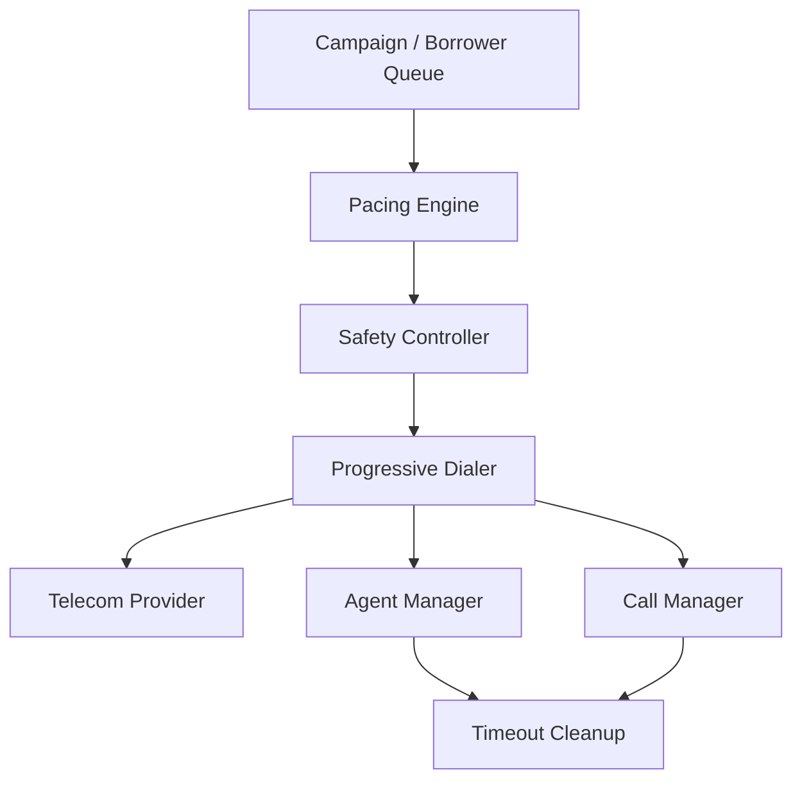

# Architecture

## High-Level Design

The SmartDialer separates **prediction, safety, and execution** into independent components.



### Component Flow

```text
Campaign / Borrower Queue
          ↓
   Predictive Pacing
          ↓
   Safety Controller
          ↓
   Progressive Dialer
       ↙   ↓   ↘
  Agents  Calls  Provider
```

### Responsibilities

| Component                     | Responsibility                                  |
| ----------------------------- | ----------------------------------------------- |
| **Campaign / Borrower Queue** | Provides calls that need to be processed        |
| **Pacing Engine**             | Calculates how many calls should be attempted   |
| **Safety Controller**         | Validates and limits the pacing recommendation  |
| **Progressive Dialer**        | Executes the approved calls                     |
| **Agent Manager**             | Maintains agent states and handles reservations |
| **Call Manager**              | Maintains call states and handles reservations  |
| **Telecom Provider**          | Simulates external call behaviour               |
| **Timeout Cleanup**           | Recovers stale agent/call reservations          |

### Key Architectural Principle

The most important boundary in the system is:

```text
Predictive Pacing
       ↓
Safety Controller
       ↓
Progressive Dialer
```

The **Pacing Engine only recommends** how many calls to attempt. It never directly places calls.

The **Safety Controller has final authority** and ensures that the recommendation does not violate the system's safety constraints.

The **Progressive Dialer is responsible for execution** and performs atomic agent/call reservations before placing calls.
