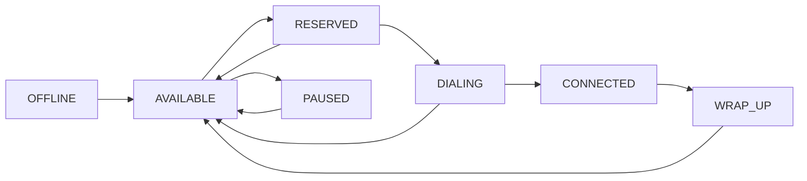
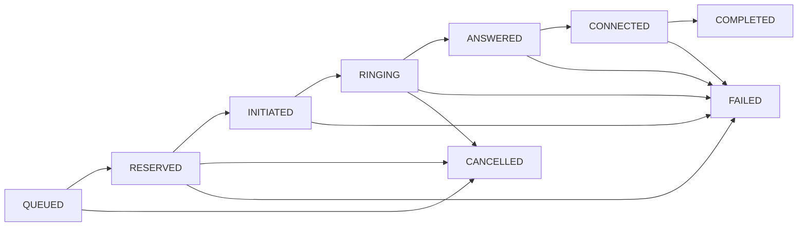

# State Machines

SmartDialer uses explicit state machines for both agents and calls.

State transitions are validated before state changes are applied. This prevents invalid lifecycle transitions and makes the behaviour easier to reason about during failures and duplicate provider events.

---

# Agent State Machine

## States

```text
OFFLINE
AVAILABLE
RESERVED
DIALING
CONNECTED
WRAP_UP
PAUSED
```

## State Diagram



---

## Agent State Descriptions

| State       | Description                                |
| ----------- | ------------------------------------------ |
| `OFFLINE`   | Agent is not available to receive calls    |
| `AVAILABLE` | Agent is available for a new call          |
| `RESERVED`  | A worker has atomically reserved the agent |
| `DIALING`   | A call is being placed for the agent       |
| `CONNECTED` | Agent is connected to a borrower           |
| `WRAP_UP`   | Agent is completing post-call work         |
| `PAUSED`    | Agent is temporarily unavailable           |

---

## Important Agent Transitions

### AVAILABLE → RESERVED

Occurs when a worker successfully reserves an agent.

```text
AVAILABLE
     ↓
tryReserveAgent()
     ↓
RESERVED
```

The reservation is atomic so that two workers cannot successfully reserve the same agent.

---

### RESERVED → DIALING

Occurs when the dialer begins placing a call for the reserved agent.

```text
RESERVED
     ↓
DIALING
```

---

### DIALING → CONNECTED

Occurs when the provider reports that the call was answered and connected to the agent.

```text
DIALING
    ↓
CONNECTED
```

---

### DIALING → AVAILABLE

Occurs when the call fails or is not answered.

```text
DIALING
    ↓
AVAILABLE
```

The agent is released for another call.

---

### CONNECTED → WRAP_UP → AVAILABLE

After the conversation ends:

```text
CONNECTED
    ↓
WRAP_UP
    ↓
AVAILABLE
```

---

### RESERVED → AVAILABLE

This can occur when a reservation must be released, for example after a failure or timeout cleanup.

---

# Call State Machine

## States

```text
QUEUED
RESERVED
INITIATED
RINGING
ANSWERED
CONNECTED
COMPLETED
FAILED
CANCELLED
```

## State Diagram



---

## Call State Descriptions

| State       | Description                                          |
| ----------- | ---------------------------------------------------- |
| `QUEUED`    | Call is waiting to be processed                      |
| `RESERVED`  | A worker has reserved the call and assigned an agent |
| `INITIATED` | The dialer has initiated the provider request        |
| `RINGING`   | The destination is ringing                           |
| `ANSWERED`  | The borrower has answered                            |
| `CONNECTED` | The call is connected to the agent                   |
| `COMPLETED` | The conversation has ended successfully              |
| `FAILED`    | The call could not be completed                      |
| `CANCELLED` | The call was intentionally cancelled                 |

---

# Call Lifecycle

The normal successful path is:

```text
QUEUED
   ↓
RESERVED
   ↓
INITIATED
   ↓
RINGING
   ↓
ANSWERED
   ↓
CONNECTED
   ↓
COMPLETED
```

The dialer and provider can also produce failure paths:

```text
INITIATED → FAILED
RINGING   → FAILED
ANSWERED  → FAILED
CONNECTED → FAILED
```

Calls that no longer need to be processed can be cancelled:

```text
QUEUED → CANCELLED
RESERVED → CANCELLED
RINGING → CANCELLED
```

---

# Idempotency and Invalid Events

External providers may send duplicate or delayed events.

For example:

```text
RINGING
   ↓
ANSWERED
   ↓
ANSWERED
```

The second `ANSWERED` event is invalid because the call is already past that transition.

Similarly:

```text
ANSWERED
   ↓
CONNECTED
   ↓
COMPLETED
   ↓
ANSWERED
```

The final `ANSWERED` event cannot move the call backwards.

The state machine therefore acts as a guard against invalid provider events.

---

# Concurrency and State

State transitions and reservations are especially important when multiple workers are running.

Example:

```text
Agent A1 = AVAILABLE

Worker 1
    ↓
tryReserveAgent(A1)
    ↓
RESERVED

Worker 2
    ↓
tryReserveAgent(A1)
    ↓
FAIL
```

Only one worker obtains the reservation.

The same principle is applied to calls using `tryReserveCall()`.

---

# Timeout Recovery

A worker may crash while an agent or call is reserved.

The system records reservation timestamps so that stale resources can be identified.

Example:

```text
Agent = RESERVED
        ↓
Worker crashes
        ↓
Reservation becomes stale
        ↓
TimeoutCleanup
        ↓
Agent released
        ↓
AVAILABLE
```

This prevents resources from remaining permanently stuck because of a worker failure.

---

# State-Machine Invariants

The implementation aims to maintain these important invariants:

### 1. An unavailable agent cannot be newly reserved

```text
Only AVAILABLE → RESERVED is allowed for new reservations.
```

### 2. One agent cannot be reserved by two workers

```text
One successful reservation → one owner.
```

### 3. Calls cannot arbitrarily move backwards

For example:

```text
COMPLETED → ANSWERED
```

is invalid.

### 4. Duplicate events do not restart a completed transition

For example:

```text
ANSWERED → ANSWERED
```

does not create another lifecycle transition.

### 5. Stale reservations can be recovered

Reservations that exceed the configured timeout can be released by `TimeoutCleanup`.

---

# Why State Machines?

Explicit state machines provide three major benefits:

1. **Correctness** – invalid transitions are rejected.
2. **Debuggability** – the current lifecycle state is clear.
3. **Failure handling** – duplicate, delayed, and unexpected events can be handled safely.

The state machines therefore form an important part of the SmartDialer safety design.
